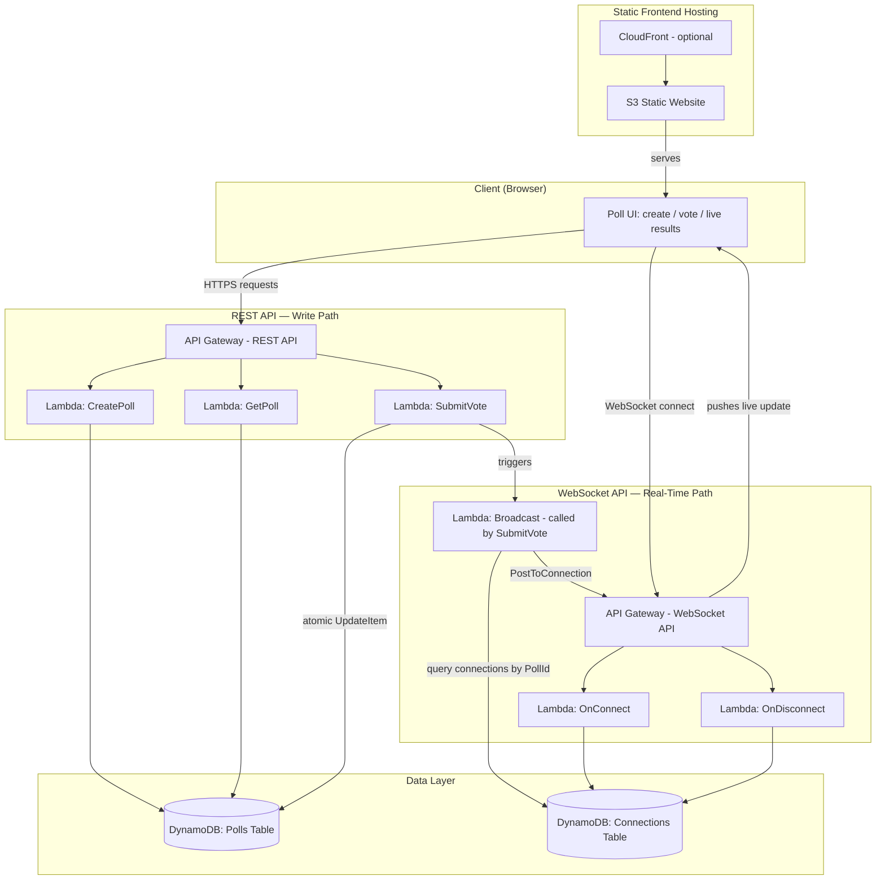
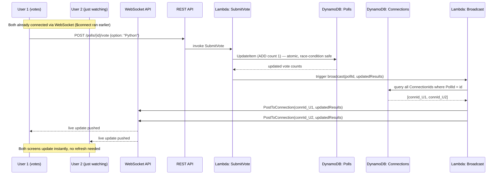
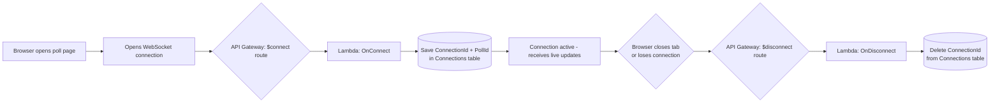

# Project Overview
## Real-Time Serverless Polling & Voting App

**Related documents:** 01_PRD.md, 02_TRD.md, 03_Task_Report.md

This document explains, in plain language, how the whole system fits together —
useful as a quick reference for your presentation and for anyone reading your
GitHub README.

---

## 1. The Idea in One Sentence

A user creates a poll, shares the link, and everyone who opens it sees vote counts
update **live** — no page refresh — because the backend pushes updates to
connected browsers over a WebSocket instead of making them ask for updates.

## 2. The Two Paths Through the System

The system has two separate "lanes" that both talk to the same DynamoDB database:

- **The Write Lane (REST API):** used to create a poll and to submit a vote.
- **The Live Lane (WebSocket API):** used to keep a connection open and push
  live results to every browser watching a poll.

## 3. Architecture Diagram

## 4. Voting Flow (Sequence / Flowchart)

This shows what happens, step by step, the moment someone clicks "Vote":

## 5. Connection Lifecycle Flowchart

## 6. Component Summary

| Component | Plain-English role |
|---|---|
| **API Gateway (REST)** | The "front door" for creating polls and casting votes |
| **API Gateway (WebSocket)** | Keeps a live, open line to every browser watching a poll |
| **Lambda functions** | Small pieces of Go code that run only when triggered — no server sits idle |
| **DynamoDB: Polls table** | Stores the question, options, and current vote counts |
| **DynamoDB: Connections table** | Tracks which browsers are currently "listening" to which poll |
| **S3 (+ CloudFront)** | Hosts the simple frontend page that users actually see |

## 7. Why This Design Solves a Real Problem

- **Without WebSockets:** every browser would have to keep asking "any new
  votes?" every few seconds (polling) — wasteful and laggy.
- **With WebSockets:** the server pushes the update the instant a vote is cast —
  instantaneous and efficient.
- **Without atomic counters:** two people voting at the exact same moment could
  overwrite each other's vote (read old count → both add 1 → write same new
  count → one vote lost).
- **With atomic `UpdateItem ADD`:** DynamoDB guarantees the increment happens
  safely even under concurrent requests — no votes lost.

## 8. Free Tier Footprint (Quick Reference)

| Service | Free tier allowance used |
|---|---|
| Lambda | A handful of invocations per test session, against 1M/month free |
| DynamoDB | A few KB of data, against 25GB free storage |
| API Gateway (REST + WebSocket) | A handful of calls/messages, against 1M/month free each |
| S3 | A few KB of static files, against 5GB free storage |

This project, even with heavy manual testing, stays far below Free Tier limits.
